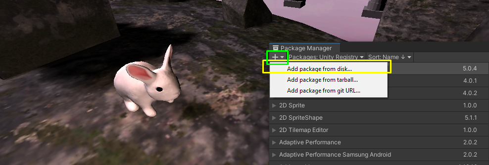

# unity-package-template

A simple package template for Unity UPM package system.

## Useful links

- [Coolest quite in-depth tutorial for starting out with custom packages in Unity](https://nagachiang.github.io/tutorial-working-with-custom-package-in-unity-2019-2)
- [OpenUPM documentation](https://openupm.com/docs/#how-it-works)
- [Tips on advanced UPM workflow](https://medium.com/openupm/how-to-maintain-upm-package-part-1-7b4daf88d4c4) 
    - I'd suggest not getting into that immediately, locally importing the package is quite efficient already:

## Samples

For working with samples I kindof follow this workflow before there are better solutions (would be cool to automate that somehow), as described in [this unity forum thread](https://forum.unity.com/threads/package-sample-workflow.734954/), quote:

For the time being, is the suggested workflow:
- Create an empty sample in the package Samples~ folder
- Import it using Package Manager UI
- Edit it until done
- Copy files back into the package Samples~ folder

